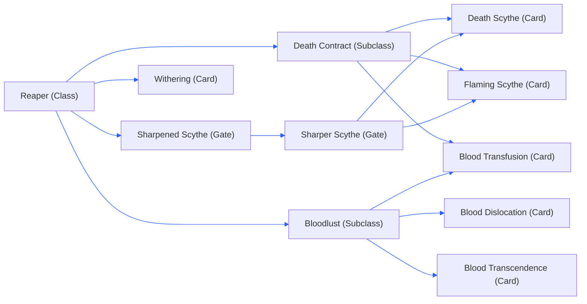

## Class Tree:

## Cards:

### Reaper Class Tree
- #### Reaper:
  **Description:** Trade your flat damage for scaling percentage damage, Percentage damage scale down more shoot per seconds you have
  
  **Extra Info:** This is the entry card for this class, once you have gotten this card the card will be unlock below
  
  **Rarity:** Uncommon
  **stats:**
	- `+10%` Percentage Damage
	- `+10%` Life Steel
	- `-80%` Flat Damage
	  
- #### Sharpened Scythe:
  **Description:** Give a small amount of percentage damage
  
  **Rarity:** Common
  **Unlock From:** `Reaper`
  **stats:**
	- `+5%` Percentage Damage
	  
- #### Sharper Scythe:
  **Description:** Give a medium amount of percentage damage
  **Rarity:** Uncommon
  **Unlock From:** `Sharpened Scythe` & `Death Contract`
  **stats:**
	- `+8%` Percentage Damage

  - #### Withering:
  **Description:** When you deal damage to players they will start taking **0.65%** scaling percentage damage per seconds
  
  **Rarity:** Uncommon
  **Unlock From:** `Reaper`

## Death Contract Tree
- #### Death Contract:
  **Description:** Trade **ALL** your flat damage, for a lot of percentage damage
  
  **Rarity:** Rare
  **Limit:** 1
  **Unlock From:** `Reaper`
  **stats:**
	- `+20%` Percentage Damage Cap
	- `+25%` Percentage Damage
	- `+35%` Life Steel
	- `-ALL` Flat Damage
	  
- #### Death Scythe:
  **Description:** You have gotten the **Death Scythe**, increasing your percentage damage and  maximum scaling percentage damage cap to (80%)
  **Rarity:** Rare
  **Limit:** 1
  **Unlock From:** `Sharper Scythe`
  **stats:**
	- `+20%` Percentage Damage Cap
	- `+15%` Percentage Damage
	  
- #### Flaming Scythe:
  **Description:** When you hit somebody you deal 15% scaling percentage damage that happen over `7.5` seconds
  **Rarity:** Rare
  **Limit:** 1
  **Unlock From:** `Sharper Scythe`
  **stats:**
	- `+15%` Percentage Damage DoT

- #### Grim Fate:
  **Description:** Upon death, release a massive spectral explosion dealing **60% of nearby enemies max health** as damage.
  Note: This effect can only trigger **once per battle**
  
  **Rarity:** Rare
  **Limit:** 1
  **Unlock From:** `Death Contract`
  **stats:**
	- `+1` Revive
	- `60% AoE Damage` on Death
	- `-30%` Health

### Bloodlust Tree
- #### Bloodlust:
  **Description:** Damaging enemies fills your **blood** based on how much of their health you take. While you still have **blood**, gain **+5% health regen/s** until fully healed
  
  **Rarity:** Rare
  **Limit:** 1
  **Unlock From:** `Reaper`
  **stats:**
	-   `+20% Blood` x Target HP%
	- `+50% Damage` x Target HP%
	- `Take Damage` If Blood Run Dry
	  
- #### Blood Transfusion:
  **Description:** When anybody excluding you takes damage you heal 25% their damage that been dealt to them
  
  **Rarity:** Uncommon
  **Limit:** 3
  **Unlock From:** `Bloodlust`
  **stats:**
	-   `+25% Heal` From Damage
	  
- #### Blood Dislocation:
  **Description:** When you block, unleash an area of effect that deals **30% of enemies max health** as damage in range.
  
  **Rarity:** Rare
  **Limit:** 1
  **Unlock From:** `Bloodlust`
  **stats:**
	-  `+30% Aera DMG` on Block
	-  `5 Seconds` Ability Cooldown
	  
- #### Blood Transcendence:
  **Description:** When you block you become **invulnerable** for time of the amount of **blood** you have. When trigger on full blood 5 seconds of being **invulnerable**. Note: this not include **passive** and **regen** blood drain
  
  **Rarity:** Rare
  **Limit:** 1
  **Unlock From:** `Bloodlust`
  **Stats:**
	- `10 Seconds` Cooldown