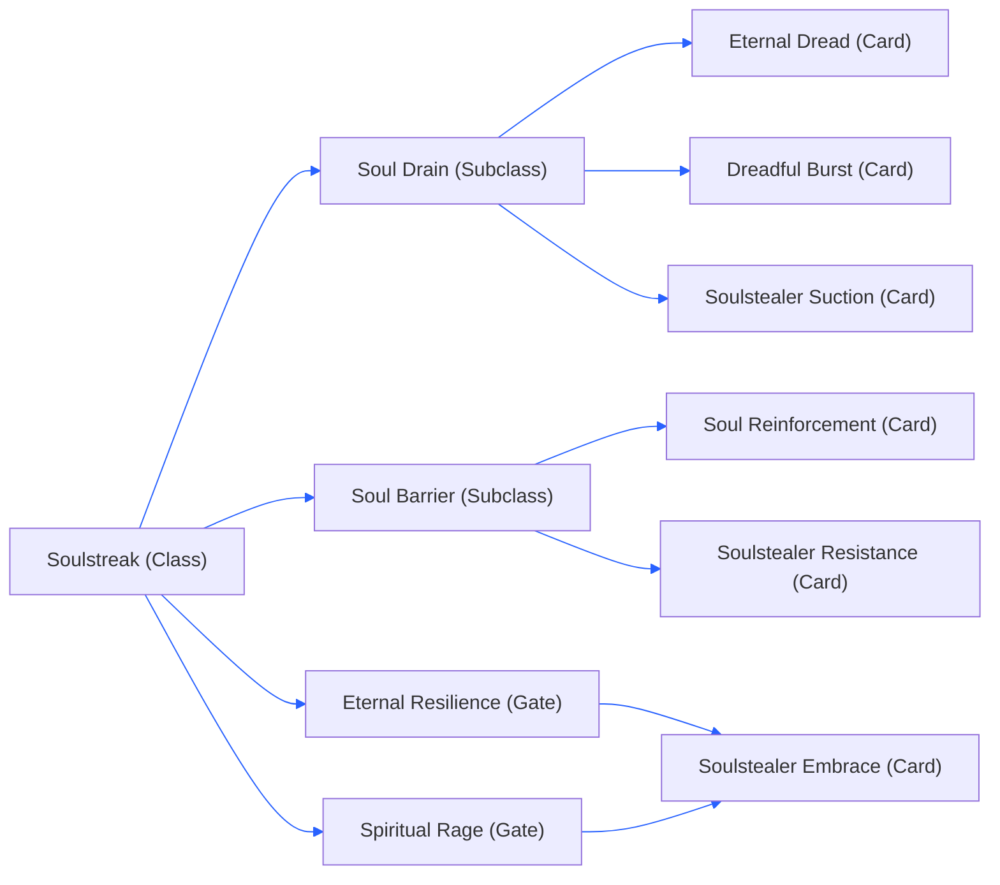

## Class Tree:

## Cards:
  
### Soulstreak Class Tree
- ####   Soulstreak:
    **Description:** When you gather souls, you become stronger.
    **Extra Info:** When the player hit a another player and that player died within a few seconds the player with the **Soulstreak** class get the souls, if the player with the **Soulstreak** died their stats given by souls will get reset 
    
    **Rarity:** Uncommon  
    **stats:**
    - `+25%` Damage Per Kill
    - `-35%` Damage
    - `Stats Reset To Base` On Death
- ####   Soul Drain:
    **Description:** This card allows you to drain the health of nearby enemies based on 15% of your DPS.
    
    **Limit:** 1
    **Rarity:** Rare  
    **stats:**
    - `+15% Your DPS` For Soul Drain DPS **[Changed]**
    - `+50%` Soul Drain Lifesteel
    - `-20%` Damage
- ####   Soul Barrier:
	**Description:** Create a soul barrier when you block, your soul barrier grows in health with more souls.
	**Extra Info:** The **Barrier** will be just armor, that cannot be pierce, and does not regen by default
    
    **Limit:** 1
    **Rarity:** Rare  
    **stats:**
	 - `+25% * (souls + 1)` Soul Armor **[Changed]**
	 - `10 Seconds` Ability Cooldown
	 - `+50%` Block Cooldown
- ####   Eternal Resilience:
    **Description:** This card allows you to become more resistant per soul gathered.
    
    **Rarity:** Common  
    **stats:**
    - `+15%` Health Per Kill
    - `-15%`Health **[Changed]**
- ####  Spiritual Rage (NEW):
	**Description:** This card allows you to become more stronger per soul gathered.
	
	**Rarity:** Common  
	**stats:**
	- `+20%` Damage Per Kill
	- `-25%` Damage
- ####  Soulstealer Embrace:
    **Description:** This card allows you to become more resistant and stronger for each soul gathered.
    
    **Rarity:** Uncommon  
    **stats:**
    - `+15%` Damage Per Kill
    - `+15%` Health Per Kill
    - `+25%` Health **[Changed]**
    - `-20%` Damage **[Changed]**
### Soul Drain Class Tree
- ####   Eternal Dread (Originally "Soul Drain Enhancement"):
    **Description:** Increase your damage of your damaging aura
    
    **Rarity:** Uncommon  
    **stats:**
    - `+7.5% Your DPS` For Soul Drain DPS **[Changed]**
    - `+15%` Damage **[Changed]**
- ####  Soulstealer Suction (NEW):
	**Description:** Your damaging aura now deal percentage damage to nearby enemies
	  
	**Limit:** 1
	**Rarity:** Uncommon  
    **stats:**
    - `+7.5% Soul Drain` Percentage DPS 
    - `-25%` Damage
  - ####  Dreadful Burst (NEW):
    **Description:** 
	    Store up to 10 ticks of damage dealt by **Soul Drian** 
	    Once fully charged, activate the ability by blocking to release the stored damage to nearby enemies 
    
	**Limit**: 1
    **Rarity:** Rare  
    **stats:**
    - `+20` DMG Tick Storage
    - `+150%` Damage Release
### Soul Barrier Class Tree
- ####   Soul Reinforcement (Originally "Soul Barrier Enhancement"):
    **Description:** This card grants your soul barrier a **7.5%** regeneration. Regeneration has a 5-second cooldown upon taking damage.
    
    **Rarity:** Uncommon  
    **stats:**
    - `+7.5%` Soul Armor Regen **[Changed]**
    - `+5% * (souls + 1)` Soul Armor Regen
    - `+20%` Health
- ####  Soulstealer Resistance (NEW):
    **Description:** You gain more damage resistant more souls you have
    Note: Damage resistant can go to maximum of **75%**
	
    **Limit:** 1
    **Rarity:** Uncommon  
    **stats:**
    - `+5% DMG Resistant` Per Souls
    - `-25%` Health